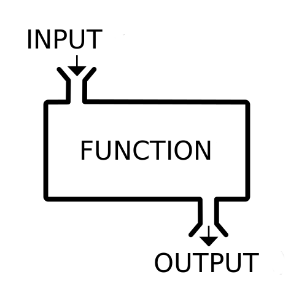

#+TITLE: Prepatory Mathematics in the Age of Information Chapter One
#+AUTHOR: teilchen010
#+EMAIL: teilchen010@gmail.com
# date ... will set (change) each time (if remembered)
#+DATE: [2015-10-06 Tue 14:32]
#+FILETAGS: :math:
#+LANGUAGE:  en
#+HTML_HEAD: <link rel="stylesheet" href="data/stylesheet.css" type="text/css">
#+EXPORT_SELECT_TAGS: export
#+EXPORT_EXCLUDE_TAGS: noexport
#+HTML_MATHJAX: align: left indent: 5em tagside: left font: Neo-Euler font-size: 1.0em
#+LaTeX_CLASS_OPTIONS: [koma]
#+LATEX_HEADER: \usepackage[makeroom]{cancel}
#+LaTeX_HEADER: \usepackage{nicefrac}
# #+LATEX_CLASS: tuftehandout
#+OPTIONS: H:10 num:4 toc:t \n:nil @:t ::t |:t _:{} *:t ^:{} prop:t
#+OPTIONS: prop:t
#+OPTIONS: tex:t
#+STARTUP: showall
#+STARTUP: align
#+STARTUP: indent
#+STARTUP: entitiespretty
#+STARTUP: logdrawer
#+STARTUP: hidestars
#+STARTUP: latexpreview
#+STARTUP: hideblocks

#+begin_html

#+end_html

#+begin_html

#+end_html

#+BEGIN_abstract

#+END_abstract

* Introduction

Once upon a time the main customer of mathematics was the greater world of physics and engineering. While math is just as involved with physics and engineering as ever, we now find it necessary to consider computers and their unique approach to mathematics. Along with classic /[[https://en.wikipedia.org/wiki/Mathematical_analysis][continuous]]/ mathematics, computers have ushered in a new era of /[[https://en.wikipedia.org/wiki/Discrete_mathematics][discrete]]/ mathematics.

Roughly speaking, /continuous/ math is the math of things in motion, e.g., objects and their paths or trajectories, forces measured to the decimal place. In continuous math there is typically a /formula/. On the other hand, /discrete/ math deals with separate, /discrete/ entities, things are usually reoresented with integers, there are /systems/ of finite, non-smoothly associated objects.

/Discrete/ mathematics is largely absent from the American secondary school curriculum, and, except for /[[https://en.wikipedia.org/wiki/Linear_algebra][linear algebra]]/, not emphasized in the first undergraduate years of American college either. And yet theoretical computer science is mainly about discrete mathematics. An issue running parallel to the dearth of discrete math is the glaring absence of any cohesive approach to programming computers. Again, secondary education offers very little programming, and outside of computer science programs, college science curricula mostly follow a "catch as catch can" approach to learning to program. For example, when this author took numerical analysis from his math department (1985), the professor offered no advice---let alone training---on how to do the programming assignments. Luckily, some of us stumbled onto [[https://en.wikipedia.org/wiki/Fortran][FORTRAN]] and hacked together our assignments, mostly by guesswork . . . and things haven't changed much in the last thirty years.

These deficiencies have been topics of discussion for many years. The first major breakthrough came in the late 1980s from [[https://en.wikipedia.org/wiki/Gerald_Jay_Sussman][Gerald Sussman]] and [[https://en.wikipedia.org/wiki/Hal_Abelson][Hal Abelson]] at MIT with their landmark textbook /Structure and Interpretation of Computer Programs/[fn:2]. Its nickname was /the wizard book/ due to the wizardy-looking cartoon character on the cover. SICP served for many years as the text for their MIT Electrical Engineering and Computer Science course /[[http://ocw.mit.edu/courses/electrical-engineering-and-computer-science/6-001-structure-and-interpretation-of-computer-programs-spring-2005/][6.001]]/. SICP was praised by many as a nexus of computer theory and numerical application. However, its use of the [[https://en.wikipedia.org/wiki/Scheme_(programming_language)][Scheme]] programming language, as well as its legendary "hard math" practice exercises doomed acceptance beyond any but the world's top university computer science programs.

Today the importance of learning math on the computer cannot be emphasized enough, as nearly all real-world mathematics is done on computers. Gone are the days of slide rules, pocket calculators, log and trig tables, gone even are the days of mainframe computers chugging away in some remote clean room at FORTRAN numerical programs. Today's math is done as much on consumer-class computers (like yours and mine) with both free and commercial software, as on massively parallel super computers in clean rooms.

 This text aims to be an aid to the instruction of basic mathematics by including the computer and programming at each step. Math will be, first and foremost, in the context of the computer. /If you can code it, you own it/ might be our motto. And to /code it/ we'll be using the /SICP/ standby Scheme, specifically the /[[https://racket-lang.org/][Racket]]/ dialect. (See Appendix [] for installation instructions, and Appendix [] for some basic skill-building.)

* The so-called real-world

In regular math we see /[[https://en.wikipedia.org/wiki/Function_(mathematics)][functions]]/, expressions, equations. A function is a statement, an equation is a statement, a mathematical expression is also a statement of some mathematical relationship, hopefully accurate and true. Math builds, derives, juxtaposes functions, expressions, equations to get at some basic, fundamental truth of the matter at hand. With an equation like $y = y_0e^{kt}$ we see a factory:

#+CAPTION: Courtesy of [[https://commons.wikimedia.org/wiki/File:Function_machine2.svg][Wikimedia Commons]]
 

of sorts that takes a thing $y$, perhaps a bacteria blob, at an initial starting time $t = 0$, that is, the blob's state at $y_0$, and multiplies it by [[https://en.wikipedia.org/wiki/E_(mathematical_constant)][Euler's "magic" constant]] $e$ raised to the power of $kt$, where $t$ is time and $k$ is a constant, i.e., $e^{kt}$. What is this for? What does it do? Well, to begin answering this question many mathematics teachers would first want their students to know where the equation came from---maybe not the whole historical rendition of when and who plucked it out of the /mathematical void/---but students should see that it is /derived/ using valid, mathematically-legal substitutions and simplifications from a more basic mathematical statement

\begin{align*}
\frac{dy}{dt} = ky
\end{align*}

. . . then the students do some homework problems, and maybe see in on a test. And there the ball stops---until a day comes when one of them must use the /exponential rate of growth or decay dependent on initial size/ formula in a real-world setting---invariably on a computer; invariably in a much messier situation than the Calculus text problem set.

* Introducing Kathy

Let us introduce /Kathy/, fresh out of college with a Masters in math and now a new hire at a huge multi-national chemical engineering firm. The last time Kathy saw anything about exponential growth/decay was in her college Calculus course some four years ago. She only remembers plugging numbers into a calculator and writing down the answer on a test. But now her new boss wants her to do some growth factor calculations "/on the computer/". Not sure how to proceed, she asks around discreetly, to which someone says "/Oh, I think you could use/ Excel /for that sort of thing./"

Googling, she [[http://www.excelfunctions.net/Excel-Growth-Function.html][finds a page]] on an Excel exponential growth formula---but it's done in some computer code, and, on top of that, it doesn't look the same as the formula she dimly recalls from college. But she's got a good head for math and a strong desire to prove herself, so she keeps after it until something works and it looks right. She takes the printout to her boss . . . and he stares at it unsmiling, looking almost like he's been insulted. Finally he hands it back to her, saying /"Have Roy set you up a [[https://en.wikipedia.org/wiki/MATLAB][MATLAB]] account."/ Yes, sir. And so Roy, her unit's sysadmin, dutifully installs said software. But just as she begins to ask "/What do I do now?/" he hands her a three pound MATLAB manual. "/Study this/," he says, smirking, an eyebrow raised.

The afternoon passes as she wades through the book's intro and first chapter, playing around with the examples on her new MATLAB account. But during lunch in the cafeteria, she overhears a group of colleagues talking about /matrices/, then something called /Python/, then something called /Clojure/. She asks them to explain, and they say MATLAB is good for some things, but their group is "writing applications." Oh.

Later, as she's at a restaurant with her friends, as they're talking about something on /YouTube/, she sighs and wishes she had seen some of this /numerical/ stuff before being thrown into the shark tank. Some sort of bridge would have been nice between the world of school math---with theories and practice problems from textbooks worked out with pencil, paper, and calculator---and the proverbial deep end of the real world where everything seemed to revolve around computers and software. She realizes that she must transform herself into a /numerical analyst/ in no time flat.

Later that night, about two chapters into an online /Numerical Analysis/ textbook, she surmises the whole point is to find strategies to /translate/ the nice, clean math of her textbooks into forms that can be carried out on computers. In effect, numerical methods are formulas to apply formulas. . . .

* SICP

An online search led her to something called the [[https://en.wikipedia.org/wiki/Structure_and_Interpretation_of_Computer_Programs][Structure and Interpretation of Computer Programs]], which, as she learned, was both a book and a course at MIT. She eventually found a nice creative commons [[http://sarabander.github.io/sicp/][online version]] of the text and started reading.

If numerical analysis was about turning math concepts into workable methods, then SICP was about turning those methods into computer code. The authors Sussman and Abelson presented the /[[https://en.wikipedia.org/wiki/Functional_programming][functional]]/ programming language /Scheme/ as the most natural fit for turning mathematical methods into code. As she Googled /functional programming/, various sources said the functional style was in numerical application preferrable to the /imperative/ style, mainly because imperative coding was apt to be too verbose in the translation of task into actual code, while functional coding stayed closer to mathematics by mimicking the actual functions.

One particular sticking point about imperative programming seemed to be how an equation like $x = 2$ was not really an equation in the math sense, but more about storing $2$ in a place in computer memory referred to as $x$. And why is that a problem? If $x = 2$ is not a true mathematical statement, rather a statement about storage, an imperative program might later reassign $x$ to "equal" something else---which, of course, violates the idea of what $x$ really is---at least mathematically-speaking . . . she wasn't really sure why that was such a big deal, but she read on.

The first chapter seemed to be reproducing with Scheme code much of what a basic pocket calculator does. She had briefly seen the programming language /C/ in a beginning computer science course, but dropped it (and forgot about a comp-sci minor as well) after getting totally frustrated with how much time and effort it took to do the simplest things. Rules, rules, rules! But what she now saw was nothing like C. Functions were built as /lists/ of nested parentheses. Apparently, Scheme was a derivative of [[https://en.wikipedia.org/wiki/Lisp_(programming_language)][Lisp]], which is based on /[[https://en.wikipedia.org/wiki/Expression_(computer_science)][expressions]]/ packaged as lists to be evaluated, rather than /[[https://en.wikipedia.org/wiki/Statement_(computer_science)][statements]]/ to be executed. . . .

She wasn't sure what all that exactly meant, but in math, you would plug numbers into a formula and get back an answer. For example, the Scheme way of setting up $f(x) = x^2$ was this:

#+name: mysquare
#+begin_src scheme :session om1 :exports both :tangle yes :cache yes :results silent
(define (mysquare x)
  (* x x))
#+end_src

Basically, the expression $let\ f(x) = x^2$ is ~(define f x (* x x))~ but with Scheme, you're encouraged to give your functions more creative names, like ~myspace~ rather than $f$. Now, if we plug in $2$, ~(mysquare 2)~, we get $4$. Now, contrast this Scheme code with C code:

#+name: mysquare_c
#+begin_src c :exports both :tangle yes :cache yes :results silent
#include <math.h>   /* for sqrt() function */ 
#include <stdio.h> 
int main( ) 
{ 
  /* variable named x with floating-point data type */ 
  float x; 
  /* standard output  writing a positive floating number */ 
  printf("\nEnter one positive number (1, 2, 3. . .): "); 
  /* standard input reading floating number */ 
  scanf("%f", &x); 
  printf("\nx = %f ", x); 
  printf("\nSquare for x is = %f", x * x); 
  return 0; 
}
#+end_src

To be fair, Scheme is normally an /[[https://en.wikipedia.org/wiki/Interpreted_language][interpreted language]]/, i.e., it has a running /[[https://en.wikipedia.org/wiki/Read%25E2%2580%2593eval%25E2%2580%2593print_loop][REPL]]/ session, where users simply feed it code live and get results back immediately, while C code must be compiled, then executed in order to interact with it. But Kathy had a bad flashback seeing all that code just to get something as simple as a square-a-number function done.

A bit odd, though, was Scheme's /[[https://en.wikipedia.org/wiki/Polish_notation][prefix]]/ notation, i.e., how the code wrote $x\ times\ x$ as ~(* x x)~, but the examples in SICP of ~(+ 1 3 5 7 11)~ made the light go on in her head how prefix notation was really handy /and/ followed the Scheme philosophy that the first thing in any list is usually a function---even if it's just a basic operator like plus (~+~). In fact, she found she could write her own plus if she wanted:

#+name: myplus1
#+begin_src scheme :session om1 :exports both :tangle yes :cache yes :results silent
(define myplus +)
#+end_src

. . . and it works just like normal ~+~. And even cooler was not just giving ~+~ a alias/pseudonym, but a real definition:

#+name: my+func
#+begin_src scheme :session om1 :exports both :tangle yes :cache yes :results silent
(define (my+func . numbers) 
  (if (null? numbers)
      0
      (+ (car numbers) (apply my+func (cdr numbers)))))
#+end_src

Kathy had found this code online, and wasn't sure what it was doing, but she ran it in the REPL and it worked: ~(my+func 1 2 3 4 5)~, which gave the correct result of ~15~.

Reinventing the /addition unary operator/ wasn't much to write home about, but it drove home the idea that addition can also be thought of as a function, just like any $f(x)...$ construct, again, with longer, more expressive names than just $f$ or $g$ or $h$ as she knew from math.

But then what about all those parentheses? Actually, they seemed to be used pretty much like math used them, i.e., to bracket off things meant to be together. In fact, they were supposed to be /lists/, specifically, nested lists. And so everything is like a [[https://en.wikipedia.org/wiki/Tree_(data_structure)][tree]]. She looked at the SICP "sum of squares" function, which took two squares and added them together:

#+name: mysqsum
#+begin_src scheme :session om1 :exports both :tangle yes :cache yes :results silent
(define (mysqsum x y)
  (+ (mysquare x) (mysquare y)))
#+end_src

Then she drew a picture of ~mysqsum~ as a tree.

#+begin_src latex :packages '(("" "qtree")) :exports results :results output raw :file tree1.png :imagemagick yes :iminoptions -density 600 :imoutoptions -geometry 800
 \Tree [.mysqsum [.+ [.mysquare [.* x x ] ] [.mysquare [.* y y ] ] ] ]
#+end_src

Next in SICP she saw this: 

\begin{align*}
 | x | = \left\{ \begin{array}{r@{\quad \mathrm{if} \quad}l} |
 x  &  x \geq 0, \\
 \!\! -x  &  x < 0. \end{array} \right.
 \end{align*}

which was then translated into this Scheme code:

#+name: myabs
#+begin_src scheme :session om1 :exports both :tangle yes :cache yes :results silent
(define (myabs x)
  (cond ((>= x 0) x)
        ((< x 0) (- x))))
#+end_src

It gives the /absolute value/ of any number plugged in, e.g., ~(myabs -1)~ gives $1$, ~(myabs 0)~ gives $0$, and ~(myabs 1)~ gives $1$.

Puzzling out the code, she saw that ~cond~ means /condition/, and that the parens are there to section off each condition to consider. First consider whether $x$ is greater than or equal to $0$ with ~((>= x ) x)~. The ~(>= x)~ part is called a /predicate/, a form that resolves to either true (~#t~ in Scheme) or false (~#f~ in Scheme). If ~#t~, ~myabs~ just give back the ~x~ you plugged in and skips the other ~cond~ form. Otherwise, go on to the next form, ~((< x 0) (- x))~, which gives back "the opposite" of the negative ~x~, a positive ~x~. It took her a second or two to [[https://en.wikipedia.org/wiki/Grok][grok]] what they were saying in SICP about how everything inside the deepest nested parens must be evaluated before considering what's next; e.g., with ~((>= x 0) x)~, Scheme first has to do the inside form, ~(>= x 0)~. Once it gets a true or false to the predicate ~>=~, it acts accordingly. So, e.g., if ~x~ is $1$ or $0$, the ~(>= x 0)~ part (form) evaluates to ~#t~ and ~x~ as you fed it into ~(myabs 1)~ wins---and then the next chunk, ~((< x 0) (- x))~ is skipped. That's how a ~cond~ works: It tests conditions, as many as you like! You can stack up a hundred conditions to test for, and as soon as one is true (~#t~), Scheme skips to the next section outside the ~cond~ closing parens.

Okay, so Kathy wasn't opposed to learning a computer language after all. Sure, it had some basic rules, /syntax/ rules, as they're called, but it all seemed doable with Scheme. And not some death march through the weeds and brambles like C was.

* Algorithms

That weekend Kathy phoned her older brother, Lee, who had recently moved to Sweden to work for a big [[https://en.wikipedia.org/wiki/Telecommunication][telecom]] company. As she told him about her new job, Lee kept chuckling in a knowing way. He knew exactly where she was at, having had to retool himself from an electrical engineer into a "numerical specialist," too. Now he was doing [[https://en.wikipedia.org/wiki/Computer_simulation][computer simulations]], writing code to control telephone systems. He agreed that functional programming was the way to go; he and his people used a language called /[[https://en.wikipedia.org/wiki/Erlang_(programming_language)][Erlang]]/, which was good at coordinating distributed computing. He also gave her some tips about the scientific computing world. Yes, he had also looked into Scheme and told her about a good, free entry-level book called /[[https://www.cs.berkeley.edu/~bh/ss-toc2.html][Simply Scheme]]/ by Cal Berkeley computer science professor [[http://www.cs.berkeley.edu/~bh/][Brian Harvey]].

Lee also said that although computers and computer science are quite mathematical, the world of computers and math aren't perfect partners. He told the [[https://en.wikipedia.org/wiki/Edsger_W._Dijkstra][Edsger Dijkstra]] quote about how computer science is no more about computers than astronomy is about telescopes. Lee noted that the main use for computers was /data management/, and that required efficient /[[https://en.wikipedia.org/wiki/Algorithm][algorithms]]/ to process the data.

Later, Kathy found the word algorithm popping up repeatedly. She watched [[https://www.khanacademy.org/computing/computer-science/algorithms/intro-to-algorithms/v/what-are-algorithms][a Khan Academy video]]
on algorithms. It said /. . . an algorithm is a set of steps to accomplish as task./ That reminded her of something she saw in a book she had just bought at a used book store, /Electronic and Computer Math[fn:1]/. It often used an /algorithmic/ approach to laying out a math problem. For example, there was a section on adding a subtracting fractions with unlike denominators. She remembered from way back in junior high learning to do /prime factorization/, which was a trick to find the /lowest common multiple/, which was, in turn, the /common denominator/. Like an algorithm, the book layed out steps to getting an answer.

- find the common denominator (CD)
- change the denominator of all fractions to this CD
- divide the CD by the old denominator of each fraction
- multiply this number by the old numerator to get the new numerator
- add (or subtract) the fractions, combining all the like terms in the numerator.

Obviously, this sort of algorithmic breakdown was necessary to tell a computer how to do unlike fraction addition. But then a fraction was just another name for a /[[https://en.wikipedia.org/wiki/Rational_number][rational number]]/, a fact that didn't occur to her until she was long out of high school. Also, the name /rational/ has more to do with the numerator and denominator forming a /ratio/ than any behavior or common sense the numbers had intrinsically---another fact not spoken very often in school. And of course an [[https://en.wikipedia.org/wiki/Irrational_number][/irrational number]]/ was simply not expressible as a ratio, and, again, had nothing to do with its view of life or behavior.

Brother Lee had also convinced her to install a [[https://en.wikipedia.org/wiki/Linux][Linux]] operating system on her trusty laptop, saying that Linux was what the "big boys and girls" use. He admitted he was kidding---sort of---but lots of the good software she would need ran natively on Linux---such as various [[http://community.schemewiki.org/?scheme-faq-standards#implementations][Scheme]] version, [[https://www.gnu.org/software/emacs/][Emacs]], [[http://www.gnuplot.info/][gnuplot]], [[https://latex-project.org/][LaTex]], and [[https://www.gnu.org/software/octave/][GNU Octave]], which was a free numerical computations package largely compatible with MATLAB. Once Linux (she went with [[http://www.ubuntu.com/][Ubuntu]]) was installed, she installed four (count em!) versions of Scheme: [[https://www.gnu.org/software/mit-scheme/][MIT Scheme]] (used for SICP), [[https://racket-lang.org/][Racket]], [[http://www.call-cc.org/][Chicken Scheme]], and [[https://www.gnu.org/software/guile/][Guile]]. Reading through some documentation, she saw that some Schemes handle rational numbers directly, even giving back rational numbers as answers. For example, in MIT Scheme

~1 ]=> (+ 1/2 1/7)~

yields

~;Value: 9/14~

. . . but that's too easy. Kathy wanted to write her own code to add "fractions" of unlike denominators. Where to start? Well, first she had to figure out how to input the fractions. If she plugged in rational numbers directly,

#+name: snippet-myaddfracs1
#+begin_src scheme :session :results silent
(define (myaddfracs1 a b)
       . . .)
#+end_src

how could she pick the denominators off of ~a~ and ~b~? Maybe there was a way, but when she tried ~(+ (/ 1 2) (/ 1 7))~ in the REPL, it still gave her ~9/14~ in rational format. Good, then something like this:

#+name: snippet-myaddfracs2
#+begin_src scheme :session :exports both :tangle yes :cache yes :results silent
(define (myaddfracs2 a b c d)
       . . .)
#+end_src

That way ~a~ and ~c~ could be the numerators and ~b~ and ~d~ the denominators. Good, but what if somebody else were using this software and didn't know to break up two fractions this way? And what operation was supposed to be performed on these fractions, addition or subtraction? So maybe throw in another parameter to indicate plus or minus? But then what about more fractions than just two? How would you add/subtract, say, $\bfrac{1}{2} + \bfrac{1}{12} + \bfrac{1}{20}$? Ha! She hadn't even started coding and already things seemed to be getting out of control.

But then she remembered that bit of code she'd found for doing her own unary plus operator. It had done something odd with a dot to make the function take as many parameters as needed. Maybe she could hack it to work here. But then ~my+func~'s first lines of code wanted to know whether the parameter bundle was empty or not. Good idea! Throw that in, too---with a slight new wrinkle:

#+name: snippet-myaddfracs3
#+begin_src scheme :session om1 :exports both :tangle yes :cache yes 
(define (myaddfracs3 . fracparams)
  (if (< (length fracparams) 2)
      #f
      #t))
#+end_src

#+RESULTS[d1b49857c8a916a41b2bc79b5bd6e16d598d1052]: snippet-myaddfracs3

Besides skipping around in SICP and Simply Scheme, she had found Kent Dybvig's [[http://www.scheme.com/tspl4/][The Scheme Programming Language]], computer music composer Orm Finnendahl's [[http://icem-www.folkwang-hochschule.de/~finnendahl/cm_kurse/doc/schintro/schintro_toc.html][An Introduction to Scheme and its Implementation]], as well as the Racket Scheme folks' [[http://www.ccs.neu.edu/home/matthias/HtDP2e/][How To Design Programs]] online. Wow! Quite a bit of knowledge about Scheme was out there from very bright, overachiever types. So SICP showed her how to set up an ~if~ statement. Then she figured out what the trick in ~my+func~ was all about, namely, something called [[http://icem-www.folkwang-hochschule.de/~finnendahl/cm_kurse/doc/schintro/schintro_68.html#SEC75][Variable Arity: Procedures that Take a Variable Number of Arguments]] according to the Finnendahl book. (She also found [[http://stackoverflow.com/questions/12658406/how-do-i-handle-an-unspecified-number-of-parameters-in-scheme/12658435#12658435][this]] and [[http://stackoverflow.com/questions/35350798/scheme-variadic-function-to-add-numbers][this]]  discussion at [[http://stackoverflow.com/][Stackoverflow]].) So the ~fracparams~ would be just a Scheme list made up of all the parameters the user fed it. Amazing how all this was just an educated hack based on what she saw with ~my+func~. And so she typed this into her REPL:

~(myaddfracs3 1 2 1 12) \to #t~

. . . /and it worked!/ Then,

~(myaddfracs3 1) \to #f~

and it worked, too.

Okay, so this solved how to add/subtract as many fractions as you wanted to---but now what? Could a rational number be handled by just one parameter---or would it always need two, like in ~myaddfracs2~? That would be sort of lame.

Her brother Lee had actually plowed through SICP back in his college days. (That's what had put him over the top for the Swedish telecom job.) She emailed him, and he replied, telling about a section in SICP ([[http://sarabander.github.io/sicp/html/2_002e1.xhtml#g_t2_002e1][2.1 Introduction to Data Abstraction]]) that talked precisely about this issue. After reading through it, she learned about /pairs/ in the Lisp/Scheme world. But then she needed to hit the Internet to find something about these /pairs/.

Well, it turned out to be a longer stop than she originally expected. She first had to back up a bit and learn the whole idea behind /lists/ in the Lisp/Scheme world. Lisp, after all, stands for /list processing/, and, yes, it's all about lists in the Scheme world as well. She found a good explanation at the Finnendahl site [[http://icem-www.folkwang-hochschule.de/~finnendahl/cm_kurse/doc/schintro/schintro_93.html][here]] that talked about building lists. Basically, it's all about something from computer science called a /[[https://en.wikipedia.org/wiki/Linked_list][linked list]]/, a data structure where data looked like it was being stored in connected train cars. So if you had a Scheme list ~(1 2 3)~, it looked like this

#+BEGIN_SRC ditaa :file omnigraphics/list123.png
       +---+---+    +---+---+   +---+---+
   --->| * | *-+--->| * | *-+-->| * | *-+-->NIL
       +-+-+---+    +-+-+---+   +-+-+---+
         |            |           |
         |            |           |
         1            2           3 
#+END_SRC

inside of Scheme, i.e., there were three quasi-boxcars, each boxcar divided into two compartments or sections. The front section was where a /pointer/ pointed to the actual thing being carried---like the numbers ~1~, ~2~, and ~3~ in our example above---while the back section had a pointer pointing to the next boxcar. Notice how the very last boxcar's back section's pointer points to ~NIL~, which is to say---the official Scheme way---that's the end of the train.

Then there was the /syntactical culture/, so to speak, for dealing with lists. In order to build a list you used the ~cons~ command. So

~(cons 1 nil)~

\begin{align*}
   A(m,n) = \left\{ \begin{array}{r@{\quad \mathrm{if} \quad}l} 
   n + 1  &  m = 0, \\
  A(m - 1,1) &  m > 0\ and\ n = 0, \\
  A(m -1, A(m,n -1)) &  m > 0\ and\ n > 0. \end{array} \right.
 \end{align*}

* /Pi/ from an algorithmic standpoint

. . .for example, Kathy found out /pi/, the ratio of a circle's circumference and its diameter, can be derived in many ways. And even before the dawn of computers, numerical methods were used to get at a real solution to the basic $\pi = \bfrac{C}{d}$.

* A Warm-up: Prime Factorization For Unlike Denominators

Seriously large denominators require the /prime factoring/ method
in order to get like-denominators.

/Prime factorization/ means /factoring out/ the /prime numbers/ of a number. For example:
  
$18 = 2(9)$ or $18$ equals $2$ times $9$ (using Algebra notation for /times/)

but $9$ is not a prime number. So we must /factor/ it:

$9 = 3(3)$

Now we can say $18 = (2)(3)(3)$ (again, using Algebra notation for /times/) or, using /powers/, $18 = 2(3^2)$ where $3^2$ is the same as $3\cdot3$ or $3$ times $3$.

Before going any further, we should maybe talk about /prime numbers/ or just /primes/. A prime is simply a number that has no possible factorization other than $1$ and itself. So this table:
    
#+tblname: primes
| 2 | 3 | 5 | 7 | 11 | 13 | 17 | 19 | 23 | 29 | 31 | 37 | 41 | 43 | 47 | 53 | 59 | 61 | 67 | 71 | 73 | 79 | 83 | 89 | 97 | 101 | 103 | 107 | 109 |

shows the first $29$ primes. Again, nobody in this table is divisible by anything other than $1$ and that number itself; no other numbers will divide into a prime number.

 When you think of numbers in terms of primes, any number is just a bunch of primes multiplied together---sometimes repeatedly, e.g.,

    \begin{align*}
    38 & = (2)(18)\\
       & = (2)(2)(9)\\
       & = (2)(2)(3)(3)\\
    \end{align*}
    or
    \begin{align*}
    38 & = (2^2)(3^2)
    \end{align*}

    So the prime factors of $38$ are just the primes $2$ and $3$. We can now say the /factors of any number are just prime numbers/. Take a look at [[https://en.wikipedia.org/wiki/Table_of_prime_factors][this link]] for a tables of the first $1,000$ numbers as factors of primes.

** A bit of Algebra; Using /symbols/ for primes.

- If we match the primes to letters, like ~a, b, c~,

  #+tblname: prime_symbols
  | a | b | c | d |  e |  f |  g |  h |  i |
  |---+---+---+---+----+----+----+----+----|
  | 2 | 3 | 5 | 7 | 11 | 13 | 17 | 19 | 23 |

  we can write the denominators of fractions like this:

  \[
  \frac{1}{85} \equiv \frac{1}{(5)(17)} \equiv \frac{1}{cg}
  \]
  where $cg$ is (as above) $c$ times $g$. (\equiv means equivalent or "the same as") And for another fraction

  \[
  \frac{1}{276} \equiv \frac{1}{(2^2)(3)(23)} \equiv \frac{1}{a^2bi}
  \]

  As you can see, the /factors/ in the denominator of both fractions are made up entirely of primes. Now we can pick a combination of these primes to make a /lowest common denominator/, which is a fancy way of saying the smallest denominator that both original denominators are some multiple of.

  \[
  \frac{1}{85} + \frac{1}{276} \quad \textrm{or} \quad \frac{1}{cg} + \frac{1}{a^2bi}
  \]

  Broken down into their prime factors, we see that the two fractions have unique prime factors, i.e., they do not share any prime factors. This means a common denominator between the two must include /all/ the prime factors /and/ their powers:

  \[
  \frac{1}{cg} + \frac{1}{a^2bi} \equiv \frac{(1)(a^2bi) + (1)(cg)}{(cg)(a^2bi)}
  \]

  If we substitute the original numbers back in. . .

  \[
  \frac{(1)(2^2)(3)(23) + (1)(5)(17)}{(5)(17)(2^2)(3)(23)}
  \]

  By the way, this is the extreme condition where the common denominator cannot be anything less than simply multiplying the original denominators. Why? What happened? The two denominators---when factored down to their respective prime factors---had /nothing/, no primes, in commmon.

  But what do we do with the numerators? We're not allowed to change the value of the fractions in our attempt to add them---and we don't. And so we use an Algebra trick to keep the fractions the same value. The trick, of course, is multiplying something by $1$, which, of course, doesn't change it:

  \[
  \bigg(\frac{1}{85}\bigg)\bigg(\frac{276}{276}\bigg) + \bigg(\frac{1}{276}\bigg)\bigg(\frac{85}{85}\bigg) \quad \textrm{or} \quad  \bigg(\frac{1\cdot276}{85\cdot276}\bigg) + \bigg(\frac{1\cdot85}{276\cdot85}\bigg)
  \]

  then

  \[
  \frac{(1)(276) + (1)(85)}{(85)(276)} = \frac{276 + 85}{23460} = \frac{361}{23460}
  \]

  Let's look at something where the denominators might be large, but have more primes in common. How about

  \[
  \frac{1}{40} + \frac{1}{81} + \frac{1}{92} \quad \textrm{or} \quad \frac{1}{a^3c} + \frac{1}{b^4} + \frac{1}{a^2i} \quad \textrm{or} \quad \frac{1}{(2^3)(5)} + \frac{1}{3^4} + \frac{1}{(2^2)(23)} 
  \]

  here we see the primes $2$, $3$, $5$, and  $23$ in use. Now we need to establish what the /lowest common denominator/ (LCD) should be. The old /brute force/ method of finding an LCD would be to simply multiply all the denominators together ($40$ \cdot $81$ \cdot $92$) and then multiply the numerators by whatever was need to keep it honest. We, however, don't need such /mathématiques brutale/. We're clever enough to sense that if a prime in one denominator is also found in another denominator, /we can simply disregard the lesser power of that prime and use the greater power to build our LCD./ Our example has just such a situation. Notice above that we have the prime $2$ in both $\frac{1}{40}$ and in $\frac{1}{92}$. Notice also that $\frac{1}{40}$ has $2^3$ while $\frac{1}{92}$ has just $2^2$. The beauty of the *prime factorization* method is that we can throw out the lesser power (here $2^2$) and build our LCD out of the greater power $2^3$

  \[
  \frac{1}{(2^3)(5)} + \frac{1}{3^4} + \frac{1}{\cancel{(2^2)}(23)}
  \]

  so now our denominator will be made up what we might call the /significant/ or /principle/ primes: $(2^3)(3^4)(5)(23)$ or $74,520$. Still /ugly/-big, but smaller by the factor of $2^2$ we were able to drop, i.e., $74,520$ < $298,080$ by a /factor/ (note the common English use of /factor/) of $4$. Now, getting the numerators right will simply be the Algebra trick of multiplying each fraction by a version of $1$, i.e., not changing its actual value, but making each fraction have like-denominators so we may add them. Again, in order to transform $\frac{1}{40}$ into a version with our LCD $74,520$, then $\frac{1}{81}$, lastly, $\frac{1}{92}$, we multiply each by a different version of $1$, in the form of $\frac{a}{a}$ where $a$ is that number, which, when multiplied by the fraction's denominator, will give the LCD, in this case $74,520$:

  \[
  \bigg(\frac{(3^4)(23)}{(3^4)(23)}\bigg)\bigg(\frac{1}{40}\bigg) + \bigg(\frac{(2^3)(5)(23)}{(2^3)(5)(23)}\bigg)\bigg(\frac{1}{81}\bigg) + \bigg(\frac{(2)(3^4)(5)}{(2)(3^4)(5)}\bigg)\bigg(\frac{1}{92}\bigg)
  \]

  or

  \[
  \bigg(\frac{1863}{1863}\bigg)\bigg(\frac{1}{40}\bigg) + \bigg(\frac{920}{920}\bigg)\bigg(\frac{1}{81}\bigg) + \bigg(\frac{810}{810}\bigg)\bigg(\frac{1}{92}\bigg)
  \]

  or

  \[
  \frac{1863}{74520} + \frac{920}{74520} + \frac{810}{74520} = \frac{3593}{74520}
  \]

  Note, we multiply each fraction by the factors the fraction's denominator doesn't contain. So with $\frac{1}{92}$, which contributed $2^2$ and $23$ to the LCD, we make the $\frac{something}{something}$

  Another way to figure out the numerators---or what we should multiply each fraction's numerator by---is to simply divide the LCD by the original denominator, e.g., for $\frac{1}{40}$ we have $74,520 \div 40 = 1,863$, and yes, $1,863$ is the same answer as before, i.e., we multiply $\frac{1}{40}$ by $\frac{1863}{1863}$ to get $\frac{1}{40}$ represented in terms of our LCD.

  

#+begin_src latex :packages '(("" "tikz")) :exports results :results output raw :file other12.png :imagemagick yes :iminoptions -density 600 :imoutoptions -geometry 800
\usetikzlibrary{arrows}

\tikzset{
  treenode/.style = {align=center, inner sep=0pt, text centered,
    font=\sffamily},
  arn_n/.style = {treenode, circle, white, font=\sffamily\bfseries, draw=black,
    fill=black, text width=1.5em},% arbre rouge noir, noeud noir
  arn_r/.style = {treenode, circle, red, draw=red, 
    text width=1.5em, very thick},% arbre rouge noir, noeud rouge
  arn_x/.style = {treenode, rectangle, draw=black,
    minimum width=0.5em, minimum height=0.5em}% arbre rouge noir, nil
}

\begin{document}
\begin{tikzpicture}[->,>=stealth',level/.style={sibling distance = 5cm/#1,
  level distance = 1.5cm}] 
\node [arn_n] {mysqsum}
    child{ node [arn_r] {+} 
            child{ node [arn_n] {10} 
            	child{ node [arn_r] {5} edge from parent node[above left]
                         {$x$}} %for a named pointer
							child{ node [arn_x] {}}
            }
            child{ node [arn_n] {20}
							child{ node [arn_r] {18}}
							child{ node [arn_x] {}}
            }                            
    }
    child{ node [arn_r] {47}
            child{ node [arn_n] {38} 
							child{ node [arn_r] {36}}
							child{ node [arn_r] {39}}
            }
            child{ node [arn_n] {51}
							child{ node [arn_r] {49}}
							child{ node [arn_x] {}}
            }
		}
; 
\end{tikzpicture}
#+end_src

* Footnotes

[fn:2] Harold Abelson and Gerald Sussman, /Structure and Interpretation of Computer Programs; Second Edition/ (MIT Press), http://sarabander.github.io/sicp/html/index.xhtml

[fn:1] Bill Deem and  Tony Zannini, /Electronics and Computer Math; Seventh Edition/ (Prentice Hall), 124.
